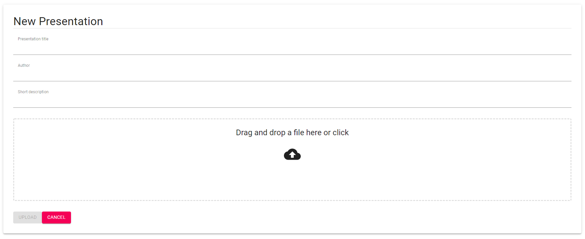

# Wefunder Assignment - 2021

## Overview

Wefunder Pitch Deck allows users to upload their pre-built pitch decks in form of PDF/PPT presentations to have them 
accessible and browsable from the web page without any additional software required (_i.e. Adobe Acrobat Reader / Microsoft PowerPoint / etc._).

The application is build in TypeScript and React, and it utilises Material-UI framework as a provider of base UI components.

In order to function correctly, the application must be able to make requests to the backend component whose endpoint address can be configured 
in the `src/config.ts` for each of the supported environments (`local` and `staging`).

## Screens

The presentations page shows all documents ever loaded into the system by its users:

On the `New Presentation` page, a user can upload their presentation document also specifying some useful info about contents of 
the document:

When the document is uploaded, it becomes available on the presentation page and can be accessed and viewed by users: 

## Available Scripts

In the project directory, you can run:

### `npm start`

Runs the app in the development mode.\
Open [http://localhost:3000](http://localhost:3000) to view it in the browser.

The page will reload if you make edits.\
You will also see any lint errors in the console.

### `npm run build`

Builds the app for production to the `dist` folder.\
It correctly bundles React in production mode and optimizes the build for the best performance.
